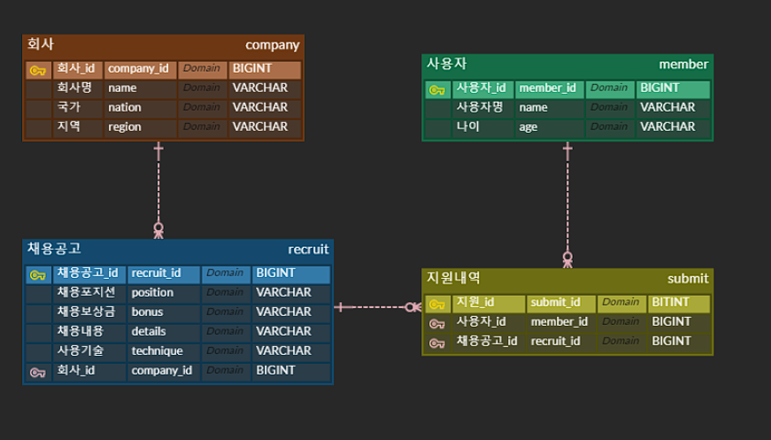

# wanted-pre-onboarding-backend

### 사전과제 요구사항 분석

API 서버를 작성한다. 이 서비스는 기업의 채용을 위한 웹서비스로 회사는 채용공고를 생성하고, 사용자는 지원한다.

- 채용공고를 등록
- 채용공고를 수정
- 채용공고를 삭제
- 채용공고 전체 목록 조회
- 채용공고 검색어로 조회 (some/url?search=원티드)
- 채용공고 상세페이지 조회 > 채용 내용이 추가적으로 담겨 있음, 해당 회사가 올린 다른 채용공고가 추가적으로 포함된다.
- 사용자가 공고에 지원 (사용자는 1회만 지원가능)
- ORM 사용하여 구현
- RDBMS 사용(SQLite, PostgreSQL, MySQL 등)

`회사, 사용자, 채용공고 지원내역은 필수모델, 필드명은 예시이고 임의 생성이 가능하다.`  
`회사, 사용자 등록 절차는 생략한다. (DB에 임의로 생성하여 진행)`  
`로그인 등 사용자 인증절차는 생략한다.`  
`프론트 요소는 개발 범위에서 제외된다.`

### 사용 스택
- Java 11 + Spring Boot 2.7.16
- Database : postgreSQL

## 구현 과정

### 커밋 컨벤션

- Feat : 새로운 기능을 추가하는 경우
- Fix : 버그를 고친경우
- Docs : 문서를 수정한 경우
- Style : 코드 포맷 변경, 세미콜론 누락, 코드 수정이 없는경우
- Refactor : 코드 리펙토링
- Test : 테스트 코드. 리펙토링 테스트 코드를 추가했을 때
- Chore : 빌드 업무 수정, 패키지 매니저 수정

### ERD 설계

### API 명세

https://documenter.getpostman.com/view/29074840/2s9YJgU1F6

### 정리
- 채용공고를 등록  

공고를 작성하기 위해서 

- 채용공고를 수정
- 채용공고를 삭제
- 채용공고 전체 목록 조회
- 채용공고 검색어로 조회 (some/url?search=원티드)
- 채용공고 상세페이지 조회 > 채용 내용이 추가적으로 담겨 있음, 해당 회사가 올린 다른 채용공고가 추가적으로 포함된다.
- 사용자가 공고에 지원 (사용자는 1회만 지원가능)